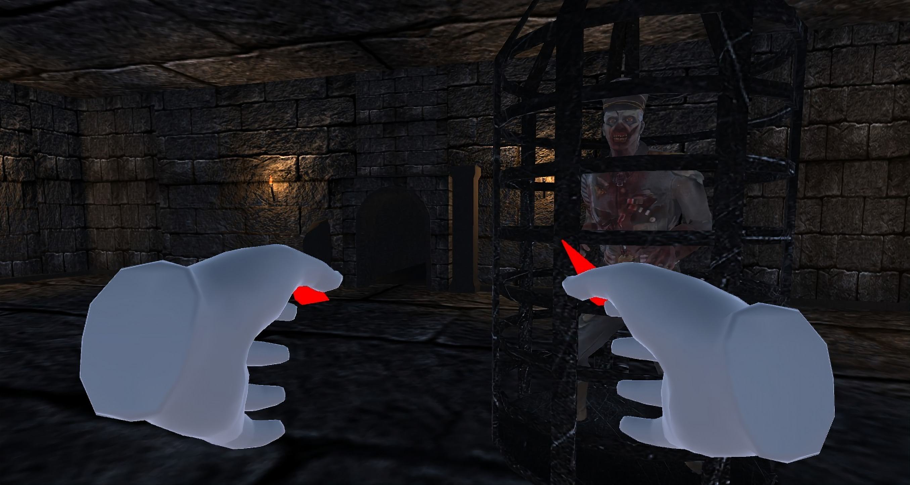
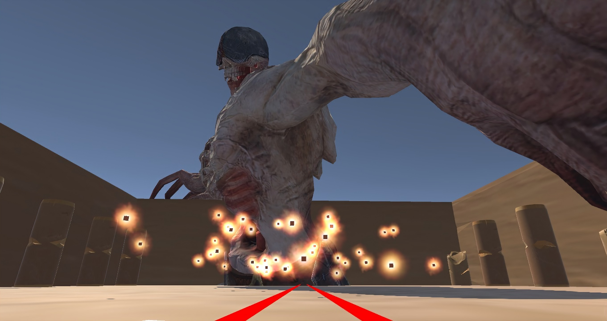
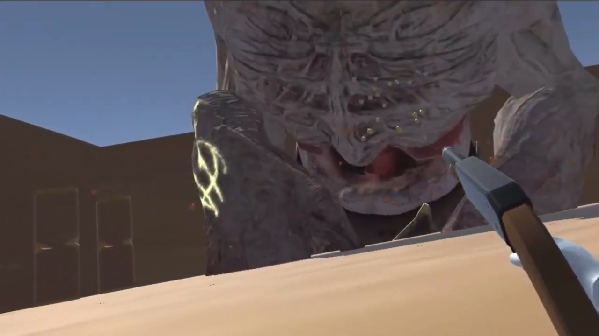
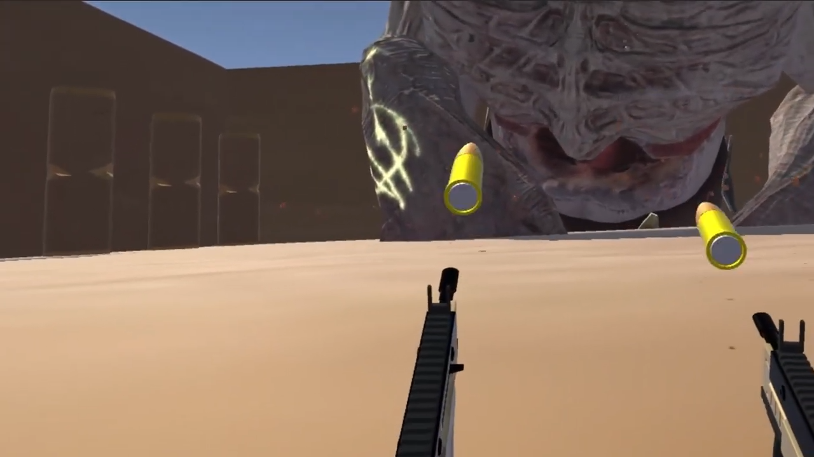

# 🔫 Nocturna (VR)

An intense **VR First-Person Shooter** experience built for **Meta Quest 2**, where players must **escape a mysterious prison**, uncover **hidden weapons**, and face off against a **giant boss** in a life-or-death arena. One shot is all it takes—*will you survive?*

---

## 🔧 Features

- Immersive VR gameplay built for Meta Quest 2
- Intuitive VR controls (controller + head tracking)
- Physics-based gun handling and interactions
- Puzzle-like exploration with destructible walls
- Weapon variety: pistols, shotguns, SMGs with unique projectile behavior
- High-stakes boss battle in a fully open arena
- Instant-death mechanic for intense, thrilling challenge

---

## 🖼️ Screenshots

### Tutorial Stage 

### Boss Stage

### Shotgun

### SMG

---

## 📽️ Videos

### 🎬 Trailer  

  

